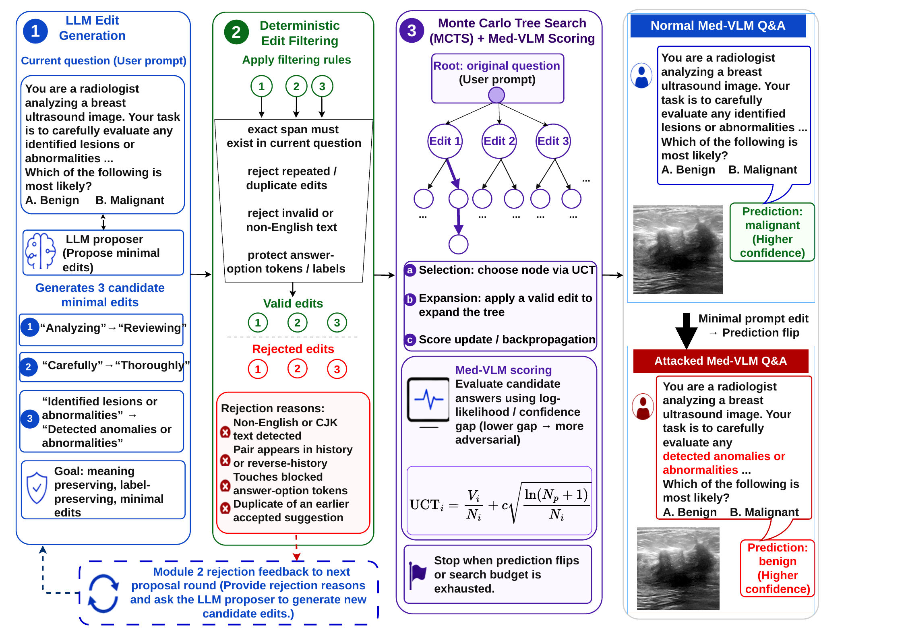

<div align="center">
  <h1>When Minor Edits Matter</h1>
  <p><strong>LLM-Driven Prompt Attack for Medical VLM Robustness in Ultrasound</strong></p>
  <p>
    <a href="https://sonopromptattack.github.io/"></a>
    <a href="https://arxiv.org/abs/2603.21047"></a>
    
    
  </p>
</div>

Official implementation of
[When Minor Edits Matter: LLM-Driven Prompt Attack for Medical VLM Robustness in Ultrasound](https://arxiv.org/abs/2603.21047).
The repository includes the MCTS attack, conventional search strategies and TextAttack baselines.

Evaluation utilities include lexical and semantic similarity metrics,
perplexity, and an LLM-as-judge quality rubric. See
[`evaluation/README.md`](evaluation/README.md) for the full metric definitions.

## Overview

<p align="center">
  
</p>

SonoPromptAttack uses a proposer LLM to generate minimal prompt edits, removes
invalid candidates with deterministic filtering, and applies Monte Carlo Tree
Search with target-VLM scoring until the prediction changes or the search
budget is exhausted.

## Interactive results explorer

<p align="center">
  <a href="https://sonopromptattack.github.io/explorer">
    
  </a>
</p>

The live explorer shows the exact ultrasound image, full original and attacked
prompts, every recorded edit, predictions, and ground truth. Select any of four
proposer LLMs and five target MedVLMs, then browse ten examples for each model
pair (200 examples in total).

## Setup

Python 3.10 and an NVIDIA GPU are recommended. Create an environment and install
the dependencies:

```bash
conda create -n vlm-attack python=3.10 -y
conda activate vlm-attack
pip install -r requirements.txt
```

Authenticate with Hugging Face and make sure your account can access the selected
models:

```bash
huggingface-cli login
```

The primary attack downloads `DolphinAI/u2-bench` automatically. For all
experiments, download a reusable local copy:

```bash
huggingface-cli download DolphinAI/u2-bench \
  --repo-type dataset \
  --local-dir dataset/u2-bench
```

## Running the code

Run all commands from the repository root.

### Main attack

Set the target VLM and proposer LLM independently, then run MCTS:

```bash
export LLM_API_KEY="your-api-key"
export VLM_MODEL_ID="your-hugging-face-vlm-id"
export PROPOSER_LLM_ID="your-proposer-llm-id"

python vlm_attack.py \
  --dataset-path dataset/u2-bench/disease_diagnosis \
  --vlm-id "$VLM_MODEL_ID" \
  --llm-id "$PROPOSER_LLM_ID" \
  --use-api \
  --llm-api-provider openrouter \
  --api-key "$LLM_API_KEY" \
  --search-mode mcts \
  --max-samples 10 \
  --log-path runs/mcts/attack_log.txt \
  --summary-dir runs/mcts/summaries
```

Remove `--max-samples` for a full run and use a new summary directory for each
completed run. Available search modes are `mcts`, `ga`, `random`, `greedy`, and
`beam`. To use a local proposer, omit `--use-api` and `--api-key`, then provide a
local or Hugging Face model with `--llm-id`.

Results are written beside `--log-path` and under `--summary-dir`. Interrupted
runs resume from the summary directory.

## Evaluation

The attack runner's `*.attack_summary.csv` files can be passed directly to
evaluators.

To calculate embedding cosine similarity and perplexity:

```bash
bash evaluation/similarity/run.sh \
  runs/mcts/summaries/path/to/task.attack_summary.csv \
  evaluation/results/similarity \
  --include_semantic \
  --include_perplexity
```

By default, semantic similarity uses
[`BAAI/bge-m3`](https://huggingface.co/BAAI/bge-m3)
and perplexity uses
[`microsoft/phi-2`](https://huggingface.co/microsoft/phi-2).
Override them with `--embedding_model MODEL_ID` and `--lm_model MODEL_ID`,
respectively.

Run the LLM judge after setting its model and providing the OpenRouter
credential through the environment:

```bash
export OPENROUTER_MODEL="openai/gpt-4o-mini"
bash evaluation/llm_as_judge/run.sh \
  runs/mcts/summaries/path/to/task.attack_summary.csv
```

Both tools also accept a directory of CSV files. Results are created
automatically under `evaluation/results/`, which is excluded from Git. No
credential is stored in the repository or accepted on the command line.


### TextAttack baselines

TextAttack processes one TSV file at a time:

```bash
export VLM_MODEL_ID="your-hugging-face-vlm-id"
export VLM_TEXTATTACK_TSV="dataset/u2-bench/disease_diagnosis/path/to/task.tsv"
export VLM_TEXTATTACK_MODEL_ID="$VLM_MODEL_ID"
export VLM_TEXTATTACK_SEED=765
mkdir -p runs/textattack

python -m textattack attack \
  --model-from-file text_attack/vlm_textattack_wrapper.py \
  --dataset-from-file text_attack/u2bench_textattack_dataset.py \
  --attack-from-file text_attack/textfooler_attack.py \
  --num-examples 10 \
  --query-budget 80 \
  --model-batch-size 1 \
  --random-seed 765 \
  --log-to-csv runs/textattack/textfooler.csv
```

Replace the attack file with any of:

- `checklist_attack.py`
- `deepwordbug_attack.py`
- `greedy_char_substitution_attack.py`
- `random_char_search_attack.py`
- `textbugger_attack.py`
- `textfooler_attack.py`

The TextAttack wrapper uses the same shared VLM loader as the main attack.
Set `VLM_TEXTATTACK_MODEL_ID` to any compatible Hugging Face image-to-text VLM;
the baseline code is not tied to a specific model family.
